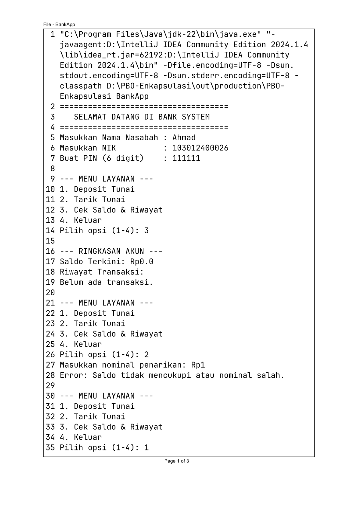
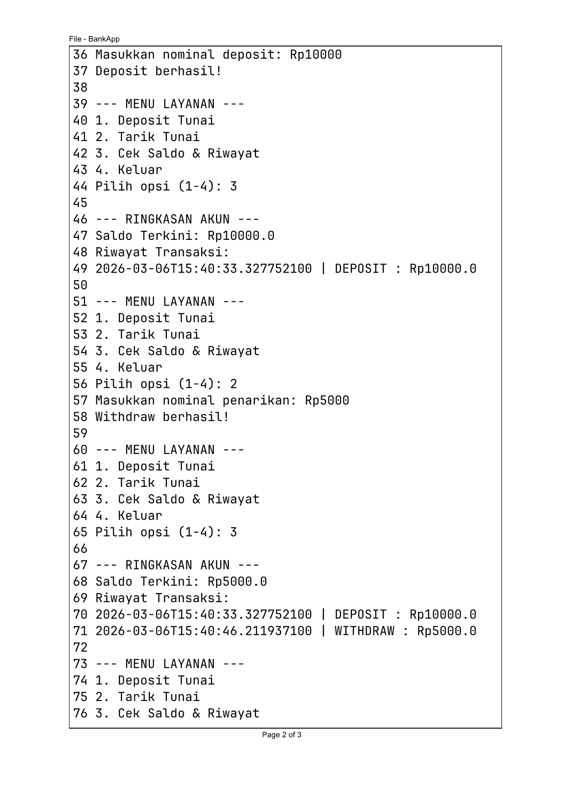
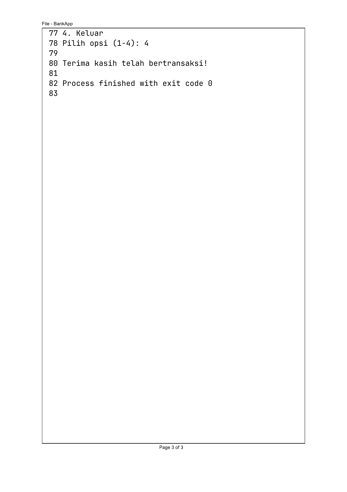
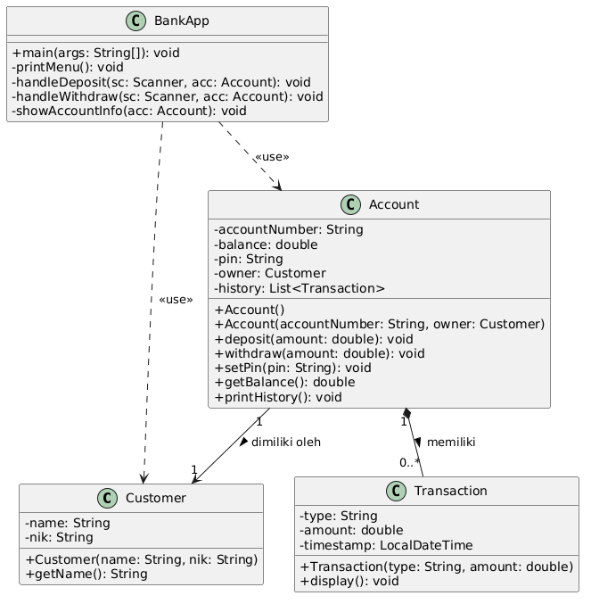

# Bank Account System (Java OOP)

Sistem perbankan berbasis CLI yang menerapkan enkapsulasi, komposisi class, dan validasi data.

## Desain Class
- **Customer**: Menyimpan profil nasabah.
- **Account**: Class utama dengan 5 atribut private untuk menjaga integritas saldo.
- **Transaction**: Komponen untuk merekam jejak transaksi (_Composition_).
- **BankApp**: Class interaktif dengan sistem menu.

## Fitur Validasi Pada Dua Method Tertentu dan Satu Setter Method
1. **Deposit**: Minimal harus positif.
2. **Withdraw**: Tidak bisa melebihi saldo.
3. **PIN**: Wajib 6 digit angka.

## Hasil Running Program
**Catatan**: Gambar running program di bawah ini digenerate lewat fitur print pada terminal intellij IDE.

## Abstraksi Diagram Kelas
**Catatan**: Tool yang digunakan untuk desain _class diagram_ di bawah ini adalah plantUML.

